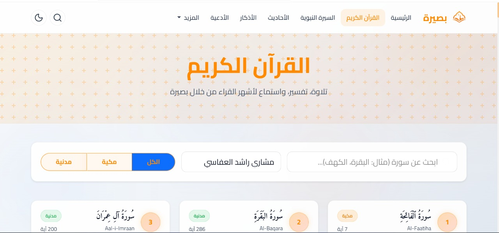
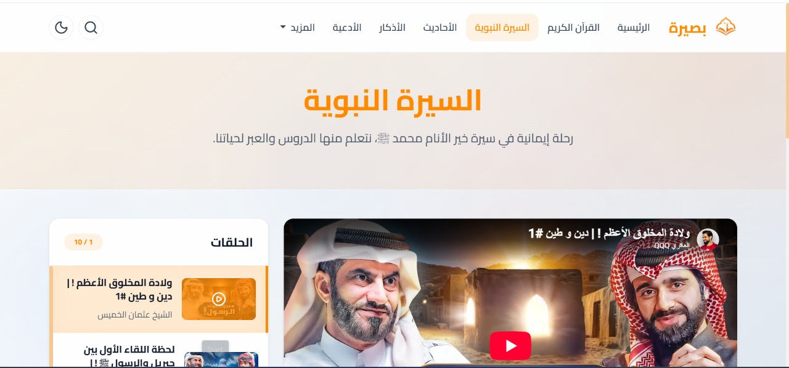
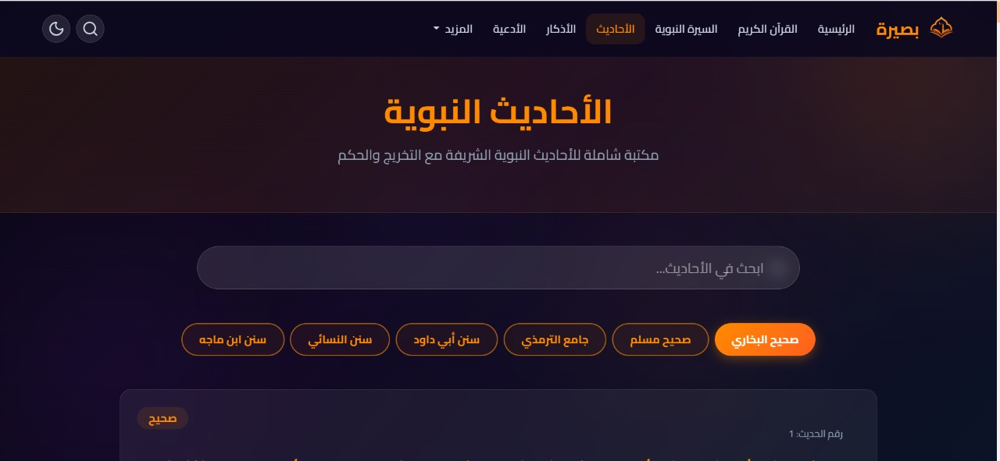
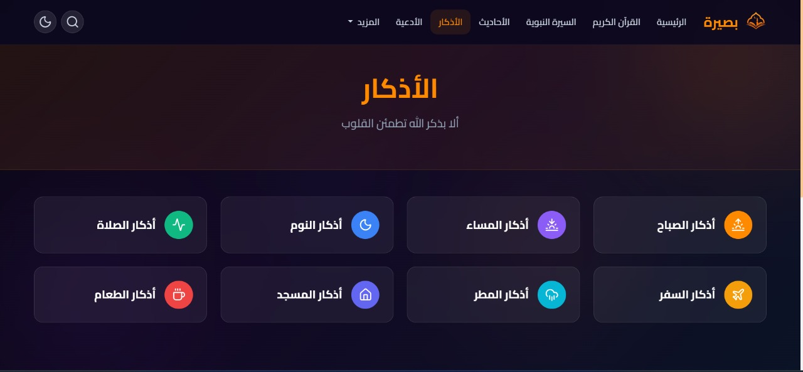
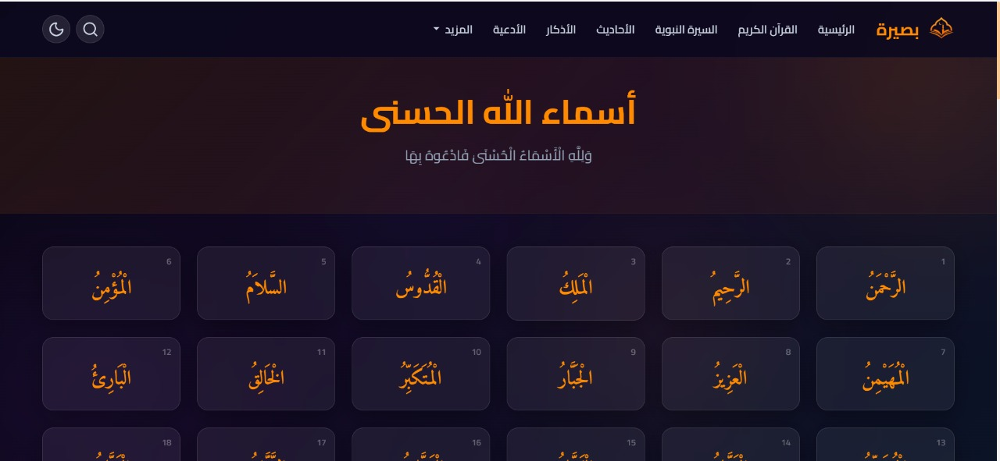
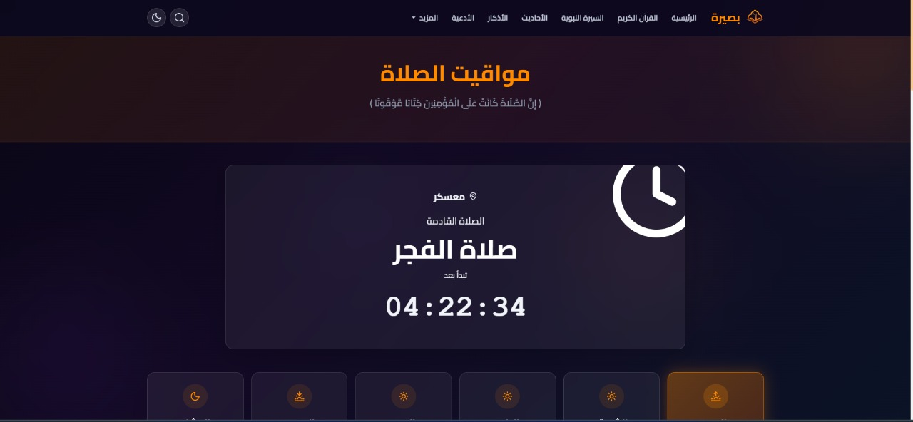

<div align="center">

  

  # 🌙 منصة بصيرة — Basseera Islamic Platform
  **بوابة إسلامية متكاملة، عصرية، ومفتوحة المصدر للقرآن الكريم، الأحاديث، الأذكار، والمحتوى الإسلامي الموثوق**

  <p align="center">
    <a href="https://basira.is-best.net/"></a>
    <a href="https://github.com/Mustaphox/basseera/blob/main/LICENSE"></a>
    
    
    
  </p>

  <p align="center">
    <a href="https://basira.is-best.net/">🌐 <b>المعاينة الحية (Live Demo)</b></a> •
    <a href="#-معاينة-واجهات-المنصة-screenshots">معاينة الواجهات</a> •
    <a href="#-مميزات-المنصة">المميزات</a> •
    <a href="#-التقنيات-المستخدمة">التقنيات</a> •
    <a href="#-التثبيت-والتشغيل-السريع">التثبيت والتشغيل</a> •
    <a href="#-هيكل-المشروع">هيكل المشروع</a> •
    <a href="#-التوثيق-الإضافي">التوثيق</a> •
    <a href="#-المساهمة">المساهمة</a>
  </p>

</div>

---

## 📸 معاينة واجهات المنصة (Screenshots)

<div align="center">

### 📖 القرآن الكريم والسيرة النبوية (الوضع النهاري)

| 📖 فهرس القرآن الكريم والتصفية والقراء | 🎥 السيرة النبوية والمشغل التفاعلي |
| :---: | :---: |
|  |  |

<br>

### 🌙 الأحاديث، الأذكار، والأسماء الحسنى (الوضع الليلي)

| 📜 موسوعة الأحاديث النبوية الشريفة | 📿 حصن المسلم والأذكار اليومية |
| :---: | :---: |
|  |  |

| ✨ أسماء الله الحسنى ومعانيها | 🕌 مواقيت الصلاة والعد التنازلي الحي |
| :---: | :---: |
|  |  |

</div>

---

## ✨ نظرة عامة على المشروع

**بصيرة (Basseera)** هي منصة إسلامية شاملة ومصممة بأحدث معايير الويب لتوفير تجربة مستخدم نقية وسريعة وخالية من التعقيد. تم بناء المنصة باستخدام **Vanilla PHP + Modern Architecture** بدون أطر عمل ضخمة، مما يجعلها خفيفة الوزن وسهلة النشر على أي استضافة (سواء كانت خوادم سحابية، استضافات مشتركة، أو بيئات محلية).

---

## 🚀 أبرز مميزات المنصة

### 📖 1. القرآن الكريم والمشغل الصوتي المتقدم
* **تلاوة السورة كاملة (Continuous Playback)**: تشغيل السورة كاملة بدون انقطاع عبر شبكات البث السريع (MP3Quran CDN).
* **التلاوة آية بآية (Ayah-by-Ayah)**: دعم الوضع التعليمي مع متابعة وتظليل الآيات أثناء التلاوة.
* **10 من كبار القراء المعتمدين**: (العفاسي، عبد الباسط، الحصري، المنشاوي، السديس، المعيقلي، الغامدي، الدوسري، الشاطري، العجمي).
* **أدوات تحكم متكاملة**: تقديم/تأخير 10 ثوانٍ، التحكم في سرعة الصوت (0.5x إلى 2.0x)، التكرار، وتنزيل السورة بصيغة MP3 مباشرة.
* **فهرس مدمج وسريع**: تصفح 114 سورة مقسمة في صفحات أنيقة مع خاصية الانتقال الفوري لأي سورة.

---

### 🔍 2. محرك البحث الإسلامي الشامل
* **بحث فوري ومتعدد الأقسام**:
  * 📖 **مطابقة السور**: الوصول السريع لبطاقة السورة برقمها أو اسمها بالعربية والإنجليزية.
  * 📜 **مطابقة الآيات**: البحث النصي في المصحف مع تظليل الكلمات وتحديد رقم الآية والسورة بدقة.
  * 💬 **الأحاديث النبوية**: البحث في متون الأحاديث والرواة.
  * 🤲 **الأذكار والأدعية**: البحث في الأدعية المأثورة.
* **تبويبات تصفية وتقسيم صفحات**: نتائج مقسمة وسلسة بدون إطالة أو تشويش.

---

### 🎨 3. نظام السمات المزدوج (Dark & Light Modes)
* **الوضع الليلي الفاخر (Dark Theme)**: ألوان داكنة ملكية مريحة للعين ليلاً مع نصوص بيضاء نقية عالية التباين.
* **الوضع النهاري الواضح (Light Theme)**: ألوان ناصعة وخطوط عالية الوضوح لسهولة القراءة في ضوء النهار.
* حفظ تلقائي للوضع المفضل في المتصفح مع حماية تامة من وميض السمة عند التحميل (Anti-Flicker).

---

### ⚡ 4. سرعة وأداء استثنائي (Performance Engine)
* **نظام كاش محلي على القرص (Local Disk Cache)**: تخزين نصوص واستجابات القرآن على السيرفر لتقليل زمن الاستجابة من 1200ms إلى **أقل من 3ms**.
* **ضغط Gzip وتقنيات التخزين المؤقت**: تسريع تحميل الموارد بنسبة 75% عبر قواعد `.htaccess` المحدثة.
* **تحميل مؤجل للخطوط والسكريبتات**: تطبيق تقنيات `preconnect` و `defer` لتفادي حظر التقديم البصري (Render-blocking).

---

### 🕌 5. مواقيت الصلاة والقبلة والتقويم الهجري
* **مواقيت دقيقة حسب الموقع الجغرافي (Geolocation)**: حساب أوقات الصلوات الخمس والشروق مع عد تنازلي حي للصلاة القادمة.
* **جدول شهري قابل للطي**: استعراض جدول الشهر بمرونة وبطريقة مدمجة.
* **بوصلة القبلة التفاعلية**: تحديد اتجاه الكعبة المشرفة بناءً على إحداثيات المستخدم.
* **التقويم الهجري والمناسبات**: استعراض التقويم والمناسبات الإسلامية البارزة.

---

### 📿 6. الأذكار، الأدعية، والسير
* **حصن المسلم والسبحة الإلكترونية**: أذكار الصباح والمساء واليوم والليلة مع عداد رقمي تفاعلي لكل ذكر.
* **الأدعية المأثورة والجامعة**: مقسمة حسب الفئات (قرآنية، نبوية، أنبياء، جوامع) مع أزرار نسخ فورية.
* **مكتبة الأحاديث الشريفة**: استعراض الأحاديث من الكتب الستة المعتمدة مع تقسيم الصفحات وتخريج الحديث.
* **قصص الأنبياء وسير الصحابة**: بطاقات شبكية عصرية مع نوافذ منبثقة (Modals) لقراءة السيرة كاملة بأسلوب قصصي راقٍ.

---

### 🛡️ 7. لوحة تحكم مدمجة (Admin Panel)
* إدارة المقالات، الأذكار، الأدعية، وإعدادات الموقع مع واجهة تسجيل دخول آمنة.

---

## 🛠️ التقنيات المستخدمة (Tech Stack)

| المجال | التقنية | الوصف |
| :--- | :--- | :--- |
| **Backend** | PHP (7.4 - 8.x) | Vanilla PHP مع بنية معيارية وبدون أطر عمل ثقيلة |
| **Database** | MySQL / MariaDB | استعلامات آمنة ومجهزة باستخدام PDO |
| **Frontend** | HTML5, CSS3, JavaScript (ES6+) | Vanilla CSS + Bootstrap 5 + Lucide Icons |
| **Fonts** | Google Fonts | Amiri Quranic Font, Cairo, Inter |
| **Audio** | MP3Quran CDN & HTML5 Audio API | بث صوتي مباشر عالي الجودة |
| **APIs** | AlQuran Cloud, AlAdhan, Hadith API | تكامل فوري وسلس للبيانات الإسلامية |

---

## 📦 التثبيت والتشغيل السريع (Quickstart)

### 1. استنساخ المشروع (Clone Repository)
```bash
git clone https://github.com/Mustaphox/basseera.git
cd basseera
```

### 2. إعداد قاعدة البيانات
1. أنشئ قاعدة بيانات جديدة باسم `basseera` في MySQL.
2. انسخ ملف الإعداد المحلي:
   ```bash
   cp config/database.local.example.php config/database.local.php
   ```
3. عدل بيانات الاتصال داخل `config/database.local.php` أو `config/database.php`.

### 3. تثبيت الجداول والبيانات
افتح المتصفح وتوجه إلى:
👉 `http://localhost/basseera/setup_db.php`

سيقوم السكريبت بإنشاء جميع الجداول تلقائياً وتثبيت المستخدم المسؤول الافتراضي.

---

## 🔑 بيانات الدخول الافتراضية للوحة التحكم

* **رابط لوحة التحكم**: `http://localhost/basseera/admin`
* **البريد الإلكتروني**: `admin@basseera.com`
* **كلمة المرور**: `password`

*(يرجى تغيير كلمة المرور مباشرة بعد التثبيت لأمان الموقع)*.

---

## 📂 هيكل المشروع (Directory Structure)

```text
basseera/
├── admin/                 # لوحة تحكم الموقع
├── api/                   # واجهات البرمجة الخلفية ونقاط البحث
├── assets/                # ملفات الـ CSS, JS, والصور
├── cache/                 # التخزين المؤقت لملفات وتلاوات القرآن
├── config/                # ملفات إعداد قاعدة البيانات
├── database/              # ملف schema.sql لقاعدة البيانات
├── docs/                  # التوثيق الشامل وأدلة التطوير
│   ├── ARCHITECTURE.md    # الهيكلية والمعمارية
│   ├── DEPLOYMENT.md      # دليل النشر على الاستضافات
│   ├── API_REFERENCE.md   # مرجع الـ APIs
│   └── CHANGELOG.md       # سجل التحديثات والتغييرات
├── includes/              # المكونات والخدمات المشتركة
├── screenshots/           # لقطات شاشة ومعاينة واجهات المنصة
├── views/                 # صفحات الواجهة الأمامية
├── .gitignore             # قواعد التجاهل في Git
├── .htaccess              # قواعد إعادة التوجيه وضغط الملفات
├── index.php              # موجّه الطلبات الرئيسي
├── setup_db.php           # مثبت الجداول التلقائي
├── logo.png               # شعار المنصة
└── LICENSE                # رخصة MIT
```

---

## 📚 التوثيق الإضافي (Documentation)

لمزيد من التفاصيل التقنية، راجع الملفات التوثيقية في مجلد `docs/`:
* [📘 دليل النشر على الاستضافات (DEPLOYMENT.md)](docs/DEPLOYMENT.md)
* [🏗️ هيكلية ومعمارية النظام (ARCHITECTURE.md)](docs/ARCHITECTURE.md)
* [🔌 مرجع واجهات البرمجة (API_REFERENCE.md)](docs/API_REFERENCE.md)
* [📝 سجل التغييرات والتحديثات (CHANGELOG.md)](docs/CHANGELOG.md)

---

## 🤝 المساهمة (Contributing)

المشروع مفتوح المصدر ومتاح لجميع المطورين للمساهمة والتطوير:
1. قم بعمل **Fork** للمستودع.
2. أنشئ فرعاً لميزتك (`git checkout -b feature/AmazingFeature`).
3. قم بحفظ التعديلات (`git commit -m 'Add some AmazingFeature'`).
4. ادفع التعديلات إلى فرعك (`git push origin feature/AmazingFeature`).
5. افتح طلب دمج (**Pull Request**).

---

## 📄 الترخيص (License)

هذا المشروع مرخص تحت رخصة **[MIT License](LICENSE)** — يمكنك استخدامه، تعديله، وإعادة توزيعه بحرية.

---

<div align="center">
  <p><b>﴿وَمَا تَوْفِيقِي إِلَّا بِاللَّهِ ۚ عَلَيْهِ تَوَكَّلْتُ وَإِلَيْهِ أُنِيبُ﴾</b></p>
  <p>صُنع لخدمة المحتوى الإسلامي الرقمي — تطوير <b>mustox</b> (Bouteldja Mohamed El Amine Mustapha)</p>
  <p>نسأل الله أن يجعل هذا العمل صدقة جارية وخالصاً لوجهه الكريم 🤲</p>
</div>
